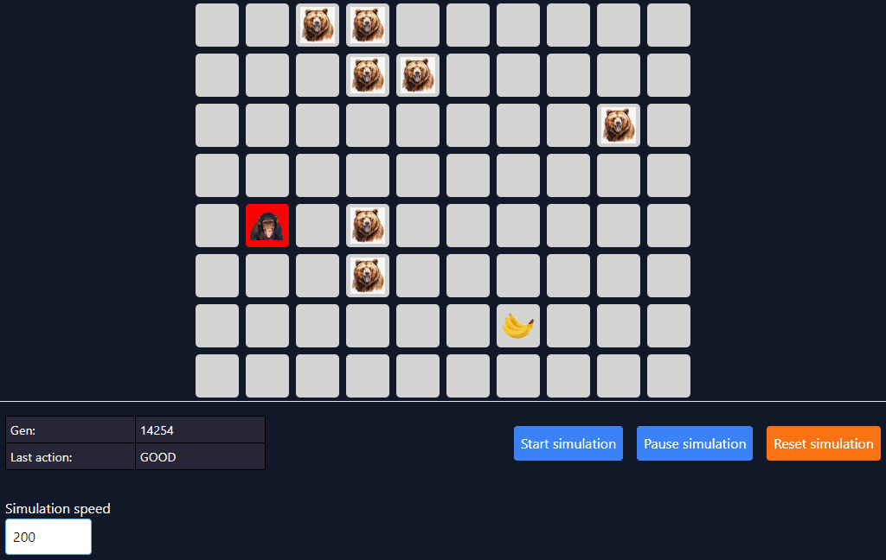

# Monkey gen

This is just a fun hacky attempt at solving a pathfinding problem using multiple generations instead of the usual algorithms like A*.

This program can just be ran by opening index.html as it only includes some dependencies from CDN's. There is no build steps.

